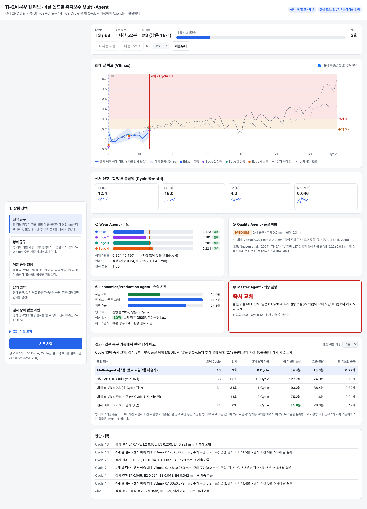

# ribon · Ti-6Al-4V 공구 유지보수 Multi-Agent 의사결정 시스템

Ti-6Al-4V 밀링 공정에서 4날 코팅 카바이드 엔드밀의 마모를 센서로 예측하고, 절삭날별 상태를 확인해
표면 품질 위험·생산 상황·손실 시간을 전문 Agent들이 분석하여 공구의 계속 가공·검사·교체를 결정하는 시스템입니다.
실제 CNC 밀링 기록(QIT-CEMC, Ti6Al4V · 4날 TiAlN 코팅 카바이드 · 건식)으로 처음부터 끝까지 재생하며 동작합니다.

## 구현 범위 (먼저 읽어 주세요)

| 기능 | 방법 | 근거 |
|---|---|---|
| 공구 마모 예측 | 힘/토크 센서 특징 → 가장 많이 닳은 날의 VBmax + 불확실성 (Ridge 회귀) | [docs/track_b_results.md](docs/track_b_results.md) |
| **절삭날별 상태** | **센서로는 구분 불가** → 필요할 때 4날 검사(실측)로 확인 | 회전 각도 신호가 없어 날별 분리 실패 (맞힌 비율 37%, 무작위 25%) |
| 판단 | 위험·불확실성·손실 시간을 보고 검사 / 계속 가공 / 윙 리브 마친 뒤 교체 / 즉시 교체 | [docs/step3_results.md](docs/step3_results.md) |
| 재판단 | 검사 결과(날별 실측)를 반영해 같은 Cycle을 다시 판단 | `src/feedback/`, `src/orchestrator/` |

즉 구조는 **센서로 위험 감지 → 필요할 때만 4날 실측 → 날별 값으로 재판단**입니다.
판단은 가장 많이 닳은 날 기준이라, 4날 평균만 보는 방식보다 한계를 훨씬 일찍 잡습니다
(실제 기록에서 최대 날은 Cycle 31, 평균은 Cycle 53에 0.3 mm 도달).

## 빠른 실행

Python 3.11 이상.

```bash
python3 -m venv .venv
.venv/bin/pip install -r requirements.txt

.venv/bin/python -m src.web                       # 시연 웹 화면 → http://localhost:8000 (끄기: Ctrl+C)
.venv/bin/pytest                                  # 테스트 62개
```

| 명령 | 내용 |
|---|---|
| `.venv/bin/python -m src.main --preset finishing` | 터미널 데모. 프리셋: `finishing` `roughing` `no_stock` `due_tight` `no_inspection` |
| `.venv/bin/python -m src.main --data synthetic` | 합성 센서 데이터 데모 (구조 확인용) |
| `.venv/bin/python -m src.models.train_wear_model` | 마모 모델 평가 → `docs/track_b_results.md` 다시 생성 |
| `.venv/bin/python -m scripts.evaluate_policies` | 판단 방식 비교·민감도 분석 → `docs/step3_results.md` 다시 생성 |

원본 센서 데이터(40GB)는 필요 없습니다. 학교 서버에서 추출한 Cycle별 특징(`data/features/qit_cemc_features.csv`, 68행)만으로 모든 실행이 됩니다.

## 시스템 구조

```
센서 특징 (Cycle마다) ─► ① Wear Agent ─► ② Quality Agent ─► ③ Economics/Production Agent ─► ④ Master Agent ─► 행동
                              ▲                                                                    │
                              └──────────── 상태 갱신 ◄── Feedback Handler ◄── 4날 검사(실측) ◄──────┘
```

| Agent | 입력 → 출력 |
|---|---|
| ① Wear | 센서 특징 → Edge 1~4 VBmax(검사 전에는 4날 같은 예측값, 검사 후 실측값), 불확실성, 편마모 지수, 센서 품질 |
| ② Quality | 마모 → 위험 등급 LOW/MEDIUM/HIGH (공구 용도별 기준), 근거, 논문 참고 Ra 범위 |
| ③ Economics/Production | 위험·생산 상황 → 행동별 기대 손실 시간, 검사 정보의 가치, 납기 지연, 생산 압박 |
| ④ Master | 세 Agent 결과 → 행동 + 이유 + 신뢰도 |

| 행동 | 의미 |
|---|---|
| `CONTINUE` | 계속 가공 |
| `REMEASURE` | 센서 재측정 (센서 이상 시) |
| `INSPECT_EDGE` | 날 검사 (`target_edge`가 없으면 4날 모두) |
| `REPLACE_AFTER_JOB` | 지금 가공 중인 윙 리브를 마친 뒤 교체 |
| `REPLACE_NOW` | 즉시 교체 |

### Master Agent 판단 순서

1. 센서 이상 → 재측정
2. 어느 날이든 VBmax ≥ 0.3 mm → 즉시 교체 (재고·납기와 상관없이 항상)
3. 검사 정보의 가치 > 검사 시간(5분)이고 예측이 불확실 → 4날 검사
4. 품질 위험 HIGH → 즉시 교체
5. 품질 위험 MEDIUM → 남은 윙 리브의 추가 불량 위험이 교체 시간보다 크면 교체(재고 없음·납기 압박이면 윙 리브 마친 뒤), 작으면 계속 가공
6. 그 외 → 계속 가공

모든 기준값은 [`src/config/thresholds.yaml`](src/config/thresholds.yaml) 한 파일에 출처 또는 'MVP 가정'과 함께 있습니다.

## 시연 웹 화면

실제 68 Cycle을 한 Cycle씩 재생합니다.

- 상황 프리셋 5개와 조건 직접 조정
- 마모 그래프 (센서 예측 ± 불확실성, 날별 실측점, 0.2/0.3 mm 기준선, 종료 후 실제 측정값 겹쳐 보기)
- 힘/토크 센서 추이, Agent 4개의 판단 카드, 판단 기록
- 검사 창: 실제 측정값이 미리 채워져 있고 발표자가 바꿀 수 있음 (예: 첫 검사에서 Edge 2를 0.35로 바꾸면 즉시 교체)
- 종료 후 같은 기록에서 판단 방식 5가지 비교표 (불량 확률 ×0.5 / ×2 전환)
- 외부 라이브러리·인터넷 없이 동작, 밝은/어두운 화면 지원



## 주요 결과

### 시연 프리셋별 판단 (실제 68 Cycle 재생)

| 프리셋 | 판단 | 이유 |
|---|---|---|
| 정삭 공구 | Cycle 13 즉시 교체, 검사 3회 | 검사로 Edge 4 = 0.221 mm 확인, 남은 8 Cycle 불량 위험 27분 > 교체 15분 |
| 황삭 공구 | Cycle 24 즉시 교체, 검사 0회 | 불량 손실이 작아 검사 가치 < 검사 시간, 0.3 mm 한계까지 사용 |
| 여분 공구 없음 | Cycle 13 윙 리브 마친 뒤 교체 | 그동안 공구 확보 |
| 납기 임박 | Cycle 13 윙 리브 마친 뒤 교체 | 지금 교체하면 납기 10분 지연 |
| 검사 장비 없는 라인 | Cycle 16 즉시 교체, 검사 0회 | 센서 예측만으로 판단해 교체가 늦어짐 |

### 판단 방식 비교 (정삭 공구, 윙 리브 1개당 손실 시간)

| 방식 | 교체 Cycle | 검사 | 한계 초과 가공 | 손실 | 그중 불량 |
|---|---|---|---|---|---|
| **Multi-Agent 시스템** | 13 | 3회 | **0** | 39.4분 | **16.3분** |
| 평균 VB ≥ 0.3 (매 Cycle 검사) | 53 | 53회 | 10 Cycle | 127.7분 | 74.9분 |
| 최대 날 VB ≥ 0.3 (매 Cycle 검사) | 31 | 31회 | 1 Cycle | 93.2분 | 38.4분 |
| 최대 날 ≥ 0.2 (매 Cycle 검사, 이상적) | 11 | 11회 | 0 | 75.2분 | 11.6분 |
| 센서 예측 VB ≥ 0.3 (검사 없음) | 24 | 0회 | 0 | **34.6분** | 28.3분 |

- 평균 기준이나 매 Cycle 검사 방식보다 손실이 훨씬 작고, 한계 초과 가공이 없습니다.
- **센서 예측만으로 0.3 mm에서 교체하는 단순 방식과는 우열이 가정에 따라 바뀝니다.** 기본 가정에서는 단순 방식의 손실이 조금 작고
  (검사 시간·이른 교체 비용), 불량 확률을 2배로 보면 시스템이 이깁니다 (55.8분 vs 62.9분). 검사의 가치는 불량이 비쌀수록 커집니다.
  황삭에서는 두 방식이 같습니다. 자세한 내용과 민감도 분석은 [docs/step3_results.md](docs/step3_results.md).

## MVP 가정값

| 항목 | 값 | 근거 |
|---|---|---|
| 교체 한계 | 0.3 mm | ISO 8688-2 공구 수명 기준 |
| 정삭 주의 기준 | 0.2 mm | Li et al. (2018), Ti-6Al-4V 표면 결함 관찰 |
| 황삭 주의 기준 | 0.25 mm | 가정 |
| Cycle당 불량 확률 LOW / MEDIUM / HIGH | 1% / 5% / 30% | **가정 (출처 없음)**, 민감도 분석 ×0.5 / ×2 |
| 윙 리브 1개 | 10 Cycle | 가정 |
| Cycle당 절삭 시간 | 8.5분 | QIT-CEMC 실측 중앙값 |
| 검사 1회 | 5분 | 가정 |
| 불량 1건 손실 | 정삭 85분(윙 리브 전체) / 황삭 8.5분(1 Cycle) | 가정 |
| 교체 시간, 재고, 납기 여유, 우선순위 | 팀 시나리오 S01~S24 | 팀 합성값 (MVP 시뮬레이션 입력) |

## 한계

- **공구 1개 기록:** 다른 공구·조건에서의 일반화는 검증하지 못했습니다. 평가는 같은 수명을 반복한다고 가정한 시뮬레이션입니다.
- **센서가 시간 이상의 정보를 준다는 근거는 없습니다:** 공구가 1개라 누적 절삭시간만으로도 비슷하게 예측됩니다.
- **절삭날별 마모는 센서로 예측하지 못했습니다:** 스핀들 엔코더(회전 각도) 신호가 있으면 날별 분리가 가능할 것으로 봅니다.
- **라벨 노이즈:** 정답 마모값이 Cycle마다 감소하기도 합니다(치핑·측정 편차).
- **데이터 손상:** 진동 파일 7개가 손상되거나 단위가 달라, 진동은 쓰지 않고 힘/토크만 씁니다.
- 불량 확률·검사 시간 등은 가정값이라 손실 수치는 '시뮬레이션 기준'으로만 말할 수 있습니다.

## 폴더 구조

```
src/
  agents/         Agent 4개 (wear, quality, economics, master)
  schemas/        Agent 간 데이터 형식
  config/         thresholds.yaml (모든 기준값), settings.py
  data/           QIT-CEMC 로더, 전처리(드리프트 제거), 특징, 합성 데이터
  models/         공구 마모 모델, 평가 스크립트, 논문 참조 데이터
  orchestrator/   실행 순서와 재판단 루프
  feedback/       검사 결과 반영
  memory/         공구 상태, 판단 이력
  simulation/     팀 시나리오 S01~S24, 시연 프리셋, 윙 리브 진행
  evaluation/     실제 데이터 재생, 판단 방식 비교
  web/            시연 웹 서버와 화면
scripts/          데이터 구조 조사·특징 추출(서버용), 판단 방식 비교
data/features/    Cycle별 특징 + Edge 1~4 VBmax (68행)
data/reference/   논문 VB–Ra 데이터, 팀 시나리오, Agent 테스트 케이스, 원본 엑셀
docs/             데이터 보고서, Track B 결과, Step 3 결과, 서버 작업 지시서, 검증 기록
tests/            테스트 62개
```

## 문서

| 문서 | 내용 |
|---|---|
| [docs/qit_cemc_data_report.md](docs/qit_cemc_data_report.md) | 데이터 확인: Ti6Al4V·4날 확인, 손상 파일, 편마모 근거, 날별 분리 시도 |
| [docs/track_b_results.md](docs/track_b_results.md) | 마모 모델 평가: 시간 순서 분할, 날 구분 가능성, 불확실성 |
| [docs/step3_results.md](docs/step3_results.md) | 판단 방식 비교, 프리셋별 결과, 불량 확률 민감도 |
| [docs/verification.md](docs/verification.md) | 최종 검증 기록 (새 환경 설치, 테스트, 데모, 웹) |
| [docs/track_a_server_guide.md](docs/track_a_server_guide.md) | 학교 서버에서 원본 데이터로 특징을 추출하는 방법 |

## 데이터 출처

- **QIT-CEMC** (Qilu Institute of Technology): https://github.com/wwz456/QIT-CEMC-dataset (MIT License)
- **VB–Ra 참조:** Nguyen et al. (2024), https://doi.org/10.1142/S0217979224400228
- **팀 시나리오·테스트 케이스:** `data/reference/Ti6Al4V_MultiAgent_통합데이터.xlsx` (MVP 합성값)
  - TC03, TC04는 목적과 맞지 않는 시나리오를 가리켜 S08, S10으로 바꿨습니다 (`data/reference/agent_test_cases.csv`에 사유 기록).
